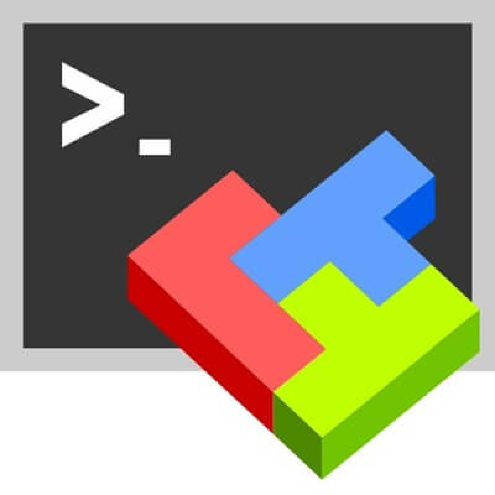

<h1 align="center">My name`s Nikita</h1>
<h3 align="center">I`m QA automation engineer</h3>

  

<h2 align="left">💁‍♂️About me</h2>

- QA automation engineer
- Write autotests in Python
- About 2 years in IT
- Feel smell tests
- Contacts:    

<h3 align="center">👽Technologies</h3>

           

           

<h2 align="left">🧑‍💻Git stats</h2>

<h2 align="left">👨‍🎓Education</h2>
<table width="100%" border="0">
   <tbody><tr> 
    <td width="30%" valign="bottom"></td><td valign="middle">School of Test Automation Engineers</td></tr>
  </tbody></table>

